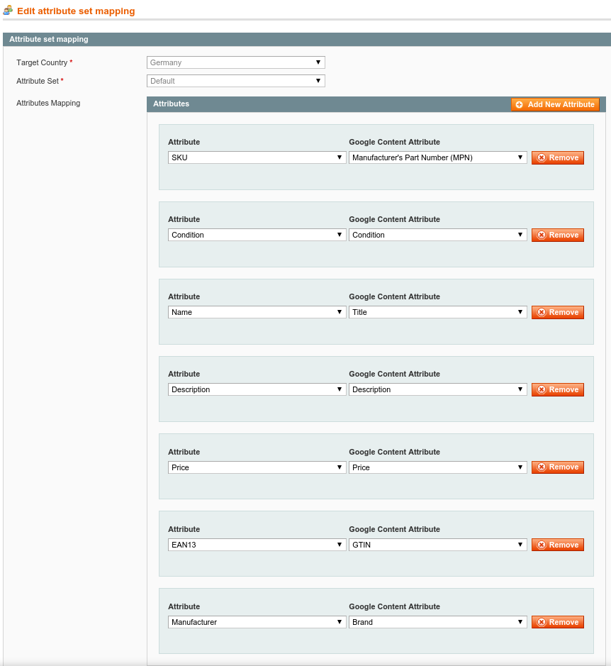

# GoogleShoppingAPI v2

## Magento Module GoogleShoppingAPI

This module is based on the official Magento GoogleShopping module and enhances
the original module features with APIv2 support (APIv1 support removed),
OAuth2 support and several additional features from the original 
EnhancedGoogleShopping module.

If the original Magento GoogleShopping module is installed, data will be migrated.

~~The observer (auto sync after saving product changes) is disabled in the current
version, but will be re-enabled soon.~~

The observer was re-enabled with version 0.1.0 . To prevent problems when users
are editing products which have no access to GoogleShopping through OAuth2, products
are only updated on GoogleShopping if a valid access token for the store exists.

To authenticate and get an access token go to Magento Admin -> Catalog -> Google 
Content APIv2 and select the store view in which you want to authenticate. 
After selecting a store view without valid access token you will be automatically
redirected to OAuth2 authentication.

## Features


* update item expiration date on sync
* option to renew not listed items on sync
* option to remove disabled items on sync
* convert html entities in description to UTF-8 chars
* strip tags from description
* make sales price available in countries outside the US
* possibility to define a separate google shopping image with base image fallback
* option to add Google Analytics source to product link (utm_source=GoogleShopping)
* option to add custom parameters to product link
* adds Austria as target country
* ability to set Google product category in Magento product details

## Installation

### Install using composer

As the Google ApiClient must be installed in addition, it is recommended to 
install using composer.

Create or adapt the composer.json file in your Magento root directory with the 
following content:

```json
{
	"require": {
		"bluevisiontec/googleshoppingapi": "*",
		"magento-hackathon/magento-composer-installer": "*",
		"google/apiclient": "*"
	},
	"repositories": [
		{
			"type": "composer",
			"url": "http://packages.firegento.com"
		},
		{
				"type": "vcs",
				"url": "https://github.com/bluevisiontec/GoogleShoppingApi"
		}
	],
	"extra": {
		"magento-root-dir": "./",
		"magento-deploystrategy": "copy"
	}
}
```

#### Install composer
```bash
mkdir bin
curl -s https://getcomposer.org/installer | php -- --install-dir=bin
php bin/composer.phar install
```

### Install manually

* Copy app, js, var to your magento root directory
* Download Google Content API Client for PHP Release 1.1.2: https://github.com/google/google-api-php-client/archive/1.1.2.tar.gz
	* Thanks to @damek132 for notice
	* Please not that version 1.1.4 has an error which will be fixed in 1.1.5
	* see https://github.com/google/google-api-php-client/commit/818b20c291b074a609da633d243bf61bcf7dfaac
* Install Google Content API to [MAGENTO_ROOT]/vendor/google/apiclient/
* You should have at least the autoload.php file and the src folder in [MAGENTO_ROOT]/vendor/google/apiclient/

### After installation

* Clean the Magento Cache and log out of the backend

## Configuration

As the module has to use Google OAuth2 a ClientId and ClientSecret for Google
Content API is required. This can be generated in the 
http://console.developers.google.com/

### Create a project in Google developers console

* Login to Google developers console or create an account
* Create a Project
  * Name: Magento-GoogleShoppingApi
  * Project-ID: use the generated id or something like magento-gshopping-841
* After the project is created go to "APIs & auth" -> "APIs"
* Search for "Content API for Shopping" and enable it
* Next go to "APIs & auth" -> "Credentials" and click "Create new Client ID"
* Select "Web application"
  * Fill out the fields "Email address" and "Product name"
  * save
* In the next step the shop backend data has to be enterend
  * "Authorized JavaScript origins": https://www.yourmagentobackend.com/
  * "Authorized redirect uris":
  * https://www.yourmagentobackend.com/index.php/admin/googleShoppingApi_oauth/auth/
* After finishing the process you can see your API credentials
  * Client ID and Client Secret must be entered in the Magento Module Configuration

### Magento Module Configuration

* Basic Module configuration: Magento Admin -> System -> Configuration -> 
BlueVisionTec Modules -> GoogleShoppingApi

  * Account-ID: Your GoogleShopping Merchant ID
  * Google Developer Project Client ID: The Client ID generated above
  * Google Developer Project Client Secret: The Client Secret generated above
  * Target Country: The country for which you want to upload your products
  * Update Google Shopping Item when Product is Updated
	* ~~Not implemented (observer disabled in current version, will be readded)~~
  * Renew not listed items
  * When syncing a product which is not listed on GoogleShopping, it will be added
  * Remove disabled items
  * Removes items which are disabled or out of stock from GoogleShopping

* Product configuration
  * In Product edit view you will find a new tab "GoogleShopping". 
    Here you can set the GoogleShopping Category. 
    The language of the category is taken from the configured store language.
    The taxonomy files for de_DE and en_US are shipped with the module package.
    Further taxonomy files should be added to /var/bluevisiontec/googleshoppingapi/data .
  * Links to taxonomy files:
    * http://www.google.com/basepages/producttype/taxonomy.en-US.txt
    * http://www.google.com/basepages/producttype/taxonomy.de-DE.txt
    
* Attributes configuration and item management can be found in Magento Admin ->
  Catalog -> Google Content APIv2

* Before uploading an item you will have to set the attribute mapping
	* Magento Admin -> Catalog -> Google Content API V2 -> Manage attributes
	* See https://support.google.com/merchants/answer/1344057 for requirements
	* Example for default attribute set
		* SKU => Manufacturer's Part Number (MPN)
		* Condition => Condition
			* You might have to add the attribute condition as DropDown with the Options new, refurbished, used
		* Name => Title
		* Description => Description
		* Price => Price 
			* Sales price is taken if set
		* EAN13 => GTIN
			* You need 2 out of 3 (MPN, GTIN, Brand), so you might add a similar attribute
		* Manufacturer => Brand
		

